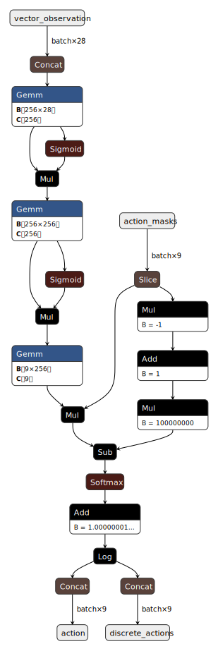

# ONNX Library

## Deployment
The onnxruntime.dll and ortClib.dll need to be in the `acplt/system/sysbin` folder. It doesn't work, if they are in the `acplt/system/addonlibs` folder:
> "... place your DLL and the onnxruntime DLL in the same folder and use run-time dynamic linking to bind explicitly to that copy ..." 
(https://www.onnxruntime.ai/docs/reference/api/c-api.html#deployment)

## Summary
This is a simple library with functionblocks to load an [ONNX](http://onnx.ai) file via C-API from [onnxruntime](https://www.onnxruntime.ai/). The C-API got wrapped in the library `ortClib`, which is build via MSVC as VS solution. The corresponding project is embedded in  folder. The `ortCTest` project shows the usage of ortClib in a small console application. To build the ortClib you may need to restore the onnxruntime nuget package inside the sln. Buildevents will copy the results to  folder of the onnx OV library.

For now only one functionblock class (UnityMLAgent) is provided, that supports to perform inference (execute the ONNX file) based on following requirements:
* 2 float vector inputs named `vector_observation` and `action_masks`
* 1 float vector output named `action`
* The file is loaded by setting the FilePath input parameter.
* Windows 32bit

Matching onnx files can be created by [Unity ML-Agents Toolkit](https://github.com/Unity-Technologies/ml-agents).
An [example ONNX file](doc/example.onnx) is included in doc folder comprising the following visualized structure via [netron app](https://netron.app/):

## Usage
* Load onnx library.
* Instanciate UnityMLAgent fb.
* Set FilePath to ONNX model file.
* Set Observation. Set ActionMask if desired.
* Activate FB (actimode = 1, iexreq must not be set).
* Read Decisions or Decision value, if Error is false.
* If Error is true, read ov log.

A corresponding [example](doc/example.fbd) can be found in doc folder. It also contains the values, that the example.onnx will deliver on execution. Don't forget to change the FilePath value.

## Licence
The used onnxruntime library uses the MIT licence.
TODO: copy license file