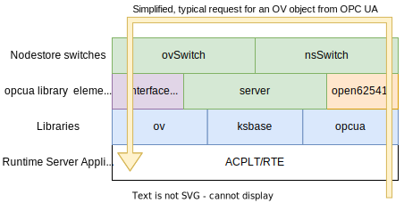
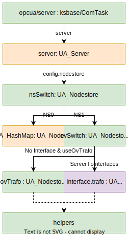
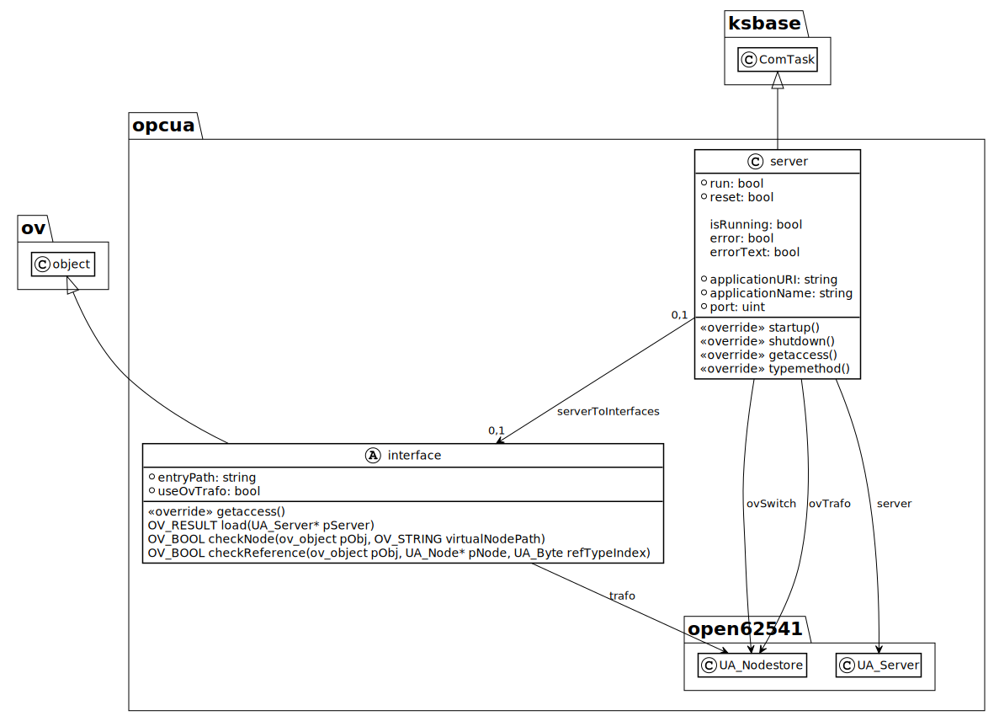

# OPC UA Server library (opcua)

This library provides the basic server functionalities for **OPC Unified Architecture** (OPC UA, IEC 62541).
It is based on the [open62541](http://www.open62541.org/) stack, which is an open source implementation of the OPC UA stack with server and client functionality in C.
The library allows to add **OPC UA server** objects in an ACPLT/RTE runtime environment to browse the ACPLT/OV object model, which is transformed to the OPC UA adress space model.
Hence, the ACPLT/RTE can be viewed and manipulated from an OCP UA client.

An [example project](https://github.com/acplt/rte_opcua_example) with a ACPLT/RTE demo library shows how to extend the transformation by specializing the `interface` class of this library to customize the OPC UA representation.
In this context **interfaces** are an abstract concept to:

* add or replace transformation rules to be evaluated by the server,
* to load information models like [OPC UA nodesets](https://github.com/OPCFoundation/UA-Nodeset) for [OPC UA Companion Specifications](https://reference.opcfoundation.org/),
* to add custom datatypes and their en/decoding.

## Usage

To use the server functionality you have to:

* load the `opcua` library.
* create an object of the type `server`.
  * optionally configure the server object, e.g. port and application name.
  * optionally create `interface` objects and link them via `serverToInterfaces` association, c.f. [example project](https://github.com/acplt/rte_opcua_example)
* set `run` to true and check that `isRunning` changes to true.
* connect from an OPC UA client, e.g. [FreeOpcUa Client GUI](https://github.com/FreeOpcUa/opcua-client-gui) or [UaExpert](https://www.unified-automation.com/de/produkte/entwicklerwerkzeuge/uaexpert.html)

## Concept

The concept utilizes the so called **nodestore** as an inferface for all accesses to OPC UA nodes inside the server, which is implemented in open62541 as a [C structure with function callbacks](https://open62541.org/doc/current/nodestore.html#nodestore-plugin-api).
These accesses to nodes inside the server are triggered, when an OPC UA client calls OPC UA services, like browsing, reading or writing nodes.
The tranformation and nodestore concept was described in various publications, e.g.:

* INDIN 2020: **OPC UA Nodestore Switch - Usage Scenarios**, DOI: [10.1109/INDIN45582.2020.9442186](https://doi.org/10.1109/INDIN45582.2020.9442186)
* Automation 2020 (german): **OPC UA Nodestore Switch - Flexible Datenhaltung und Informationsmodellierung für OPC UA Server**, DOI:[10.51202/9783181023754-469](https://doi.org/10.51202/9783181023754-469)
* KommA 2016 (german): **Modelltransformation als Softwareadapter für OPC Unified Architecture**, [KommA Paper Archiv](https://www.jk-komma.de/index.php/paper-archiv)

The basic structure of source files and libraries with a simplified typical request is shown in the following figure:

Another view of the structure focussed on the nodestore switches is shown below:

The *opcua* library contains a *server* class derived from *ksbase/ComTask*, which holds a pointer to the *UA_Server* as *server* variable.
An UA_Server contains a *configuration*, which holds the *nodestore* that is redirected to the namespace index based nodestore switch *nsSwitch*.
Accesses to namespace zero (OPC UA namespace) are directed to the open62541 *UA_HashMap* nodestore.
Accesses to namespace one (application namespace) are directed to the interface based nodestore switch *ovSwitch*.
The ovSwitch redirects accesses to the generic transformation of ov elements *ovTrafo*, if no interface is connected or the *checkNode* function of a connected interface returns false and the variable *useOvTrafo* is set to true.
Otherwise the transformation (*trafo* variable) of the connected interface is used.
The opcua_helpers.c/h provide utility functions for the generic and custom tranformations.

## Library Content

As shown in the UML diagram above, the library comprises a `server`, an abstract `interface` class and the `serverToInterfaces` association:

* **Server** ([server.c](source/server.c)):
    special ks communication task, that creates, configures and runs the OPC UA server based on its settings.
    Multiple servers can be created, e.g. to allow for different security settings or transformations. Make sure to use different ports, when using multiple OPC UA servers in one runtime environment.
  * **Namespace Switch** ([nsSwitch.c](source/nsSwitch.c)):
    Replaces the standard nodestore of the open62541 OPC UA server with a switch that chooses configurable nodestores based on the namespace index of the OPC UA node to access.
  * **OV Switch** ([ovSwitch.c](source/ovSwitch.c)):
    Replaces the nodestore for namespace 1 (application namespace) in the nsSwitch by a switch that decides between a generic transformation (ovTrafo), the `trafo` of a linked interface or no access (NULL/ErrorCode).
  * **OV Trafo** ([ovTrafo.c](source/ovTrafo.c)):
    A nodestore, that creates OPC UA nodes from the ACPLT/OV objects (respectively elements or even virtual objects) requested via the string identifier of nodeIds, to allow for an unidirectional transformation (plus writing of values).
  * **Helpers** ([helpers.c](source/helpers.c)):
    Helpful functions, that are used in multiple source files or that are usefull for custom transformations.
* **Interface** ([interface.c](source/interface.c)):
  * **Server to Interfaces** ([serverToInterfaces.c](source/interface.c)):
    Used to link a server to a custom interface that is derived from the abstract interface class.

## Remarks

### Unidirectional transformation

The generic transformation is mainly unidirectional from ACPLT/OV to OPC UA.
Only necessary backtransformations for writing variable values are implemented via the getNodeCopy and replaceNode nodestore functions.
So the ACPLT/OV model can't be directly modified via [OPC UA nodemanagement services](https://open62541.org/doc/1.2/services.html?highlight=nodemanagement#nodemanagement-service-set).

### Historic data access

Currently, no [historic data access](https://open62541.org/doc/1.2/services.html?highlight=nodemanagement#historyread-service) is implemented.
If historic variable values should be accessed, the opcua library has to be extended according to [kshist](../kshist/) library.

### Cardinality and dynamic changes of serverToInterfaces

In prototypical versions (c.f. literature under [concept](#Concept)) multiple interfaces could be connected to the server, which was even possible if the opcua server was already running.
The generic transformation was also modeled as an interface, which was added to the server as a part.
This is very flexible and modular, but demands very robust and complicated interface implementations.
Moreover, the dependency of different transformations, nodesets and data types has to be considered.
Also, multiple possibilities exisist to decide which transformation / interface to use.

For the sake of simplicity and maintainability we decided to allow only one interface for each opcua server, which can only be changed if the server is offline.
This is suitable for most use cases and - if necessary - a special interface could be created, that manages to integrate multiple other interfaces.

### Partial Transformation of nodes

Currently, a whole node is temporarily created and respectively transformed for every getNode call, even though only parts of it are needed and evaluated by the open62541 server, e.g. a single attribute like the browse name.
This is a huge overhead, especially if a single service call from OPC UA might lead to multiple getNode calls, e.g. by traversing browspaths or types.
The [current changes to the nodestore api](https://github.com/open62541/open62541/commit/6b8db940e5fb4699c7bcde777fc7b21234cc947b) seem promising for future optimizations, but they are currently only available in the master branch and will probably become available in v1.4 or later as the api for v1.3 is already frozen.

### Security

Currently, the security configuration of the OPC UA server is [set to the default minimum config](https://github.com/open62541/open62541/blob/fc20b59cc886d42e5e43f3904fe3cd139433ecce/plugins/include/open62541/server_config_default.h#L53-L63) during [server startup](source/server.c#L77) with no certificate.
To extend this, the opcua library or a derived one should expose the configuration as variables of the opcua server object, e.g. User/Password or certificate/key locations, utilizing OPC UA and respectively open62541 security options.
Although, this would expose the UA security settings via KS.
Hence, it may be necesseary to align the security settings with the KS ticket system.

Moreover, the [access control plugin](https://open62541.org/doc/1.2/plugin_accesscontrol.html#access-control) should be utilized if node or attribute based access control should be realized instead of server wide (securechannel based) authorization.

As multiple OPC UA servers can be instantiated within one ACPLT/RTE server the ACPLT/OV model can be explored with different security settings (and transformations/views) via different network ports.

## Compilation Hints

The open62541 project is included as a shallow submodule referencing a commit of branch 1.3 after release candidate 1 ([v1.3-rc1](https://github.com/open62541/open62541/releases/tag/v1.3-rc1)), so that the 1.3 api should be stable within minor version changes.
This allows us to keep the opcua library up-to-date with open62541 v1.3.
To update to newer minor open62541 versions (e.g. v1.3.0 or v1.3.1) check out the submodule withouth depth set to 1 (not shallow).

The following defines for open62541 are important (c.f. [CMakeLists](CMakeLists.txt)):

* UA_ENABLE_IMMUTABLE_NODES: ON.
For performance reasons the UA_Server retrieves nodes via `getNode` and edits them in place on default.
Our nodes exist only temporarily as they are created on access.
Hence, we need to enable the immutable nodes option to let the server use `getNodeCopy` and `replaceNode` instead of modifying nodes directly.
* UA_ENABLE_NODEMANAGEMENT: OFF.
Nodemanagement (adding and deleting nodes from an OPC UA client) is currently not implemented, as no backtransformations (UA_Node --> OV object/element) are implemented.
* UA_NAMESPACE_ZERO: REDUCED.
If the full namespace 0 is compiled, the server startup is very slow, which is a problem, as the server is started via set accessor of the run variable.
Hence, we stick to the default setting of open62541, which includes the most important nodes for many use cases.
